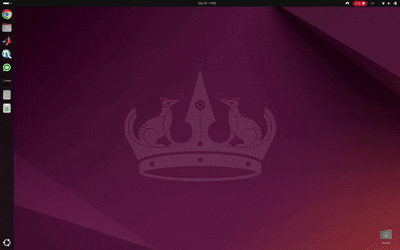

# 🚀 ROS 2 App Launcher

A **graphical launcher for ROS 2** that makes it simple to discover, run, and manage executables and launch files in your ROS 2 workspaces.  
No more memorizing long `ros2 run` or `ros2 launch` commands, just point it to your workspace and click!

<p align="center">
  
</p>

## ✨ Features

- 🔍 **Automatic Workspace Scanning**
  - Detects ROS 2 packages under a given root folder (`--root`).
  - Finds both **source-tree packages** and **installed packages**.

- ⚙️ **Executables Management**
  - Lists executables available in each package.
  - Run them with `ros2 run <pkg> <exe>` directly from the GUI.
  - Add extra arguments in the provided input field.
  - Filters out non-executable assets (like `.png`).

- 🚀 **Launch Files Management**
  - Detects `.launch.py`, `.launch.xml`, `.launch.yaml`, and files ending with `_launch.*`.
  - Works for both **source** (`./launch/`) and **installed** (`share/<pkg>/launch/`) packages.
  - Automatically parses and prompts for **launch arguments** (Python, XML, YAML).
  - Provides a dialog box where you can override default argument specification before launching.

- 📝 **Custom Launch**
  - Enter either a **path** or a `<package> <launch_file>` spec.
  - Supports additional arguments.

- 🖥️ **Handy Shortcuts**
  - Launch RViz2 with one click.
  - Launch `rqt_graph`.
  - Launch `rqt` (plugins).

- 🎨 **Desktop Integration**
  - Installs as a **desktop app** with its own icon.
  - Launchable from your system’s application menu.
  - Search **"ROS 2 App Launcher"** in your desktop environment.


## 📂 Project structure

- **assets** (save figures and scripts)
- **ros2_app_launcher.py**  (Main Python script (GUI))
- **desktop_setup.sh** (Setup script for desktop app)
- **README.md** (Documentation)

## ⚙️ Installing
```bash
git clone https://github.com/kr1zzo-NTNU/ROS2_app_launcher.git
```

## 📋 Requirements

- **ROS2** (tested with **Jazzy**, compatible with Humble/Foxy).
- **Python 3.9+**
- **Tkinter** for GUI:
  ```bash
  sudo apt install python3-tk

## ▶️ Running the code

Run from the workspace root directory:
```bash
python3 ros2_app_launcher.py --root ~/
```

Run from inside your workspace for a simplified package tree:
```bash
python3 ros2_app_launcher.py --root ~/path_to_your_ws/my_ros2_ws
```

## 🖼️ Setting Up a desktop app

```bash
chmod +x desktop_setup.sh
./desktop_setup.sh
```

## 💻 Setting Up Desired Terminal and ROS2 distro

In the code, you can set up the preferred terminal by placing it first in the list in *TERMINAL* list.
For example, if Terminator is listed first, the script will try to use it.
If it isn’t installed, it will fall back to the next available option. Also you can set default ROS2 distro by chagning *DEFAULT_ROS_SETUP* argument:
```bash
# ----------------------------- Config (edit to taste) ----------------------------
DEFAULT_ROS_SETUP = "/opt/ros/jazzy/setup.bash"   # change to your distro if needed
DEFAULT_WS_SETUP = ""                              # blank -> auto-detect upward install/setup.bash
TERMINALS = [
    ["terminator", "-e", "bash -lc '{CMD}; exec bash'"],
    ["gnome-terminal", "--", "bash", "-lc", "{CMD}; exec bash"],
    ["x-terminal-emulator", "-e", "bash", "-lc", "{CMD}; exec bash"],
    ["konsole", "-e", "bash", "-lc", "{CMD}; exec bash"],
    ["xterm", "-e", "bash", "-lc", "{CMD}; read -p 'Press enter to close...' && exit"],
    ["kitty", "bash", "-lc", "{CMD}; exec bash"],
    ["alacritty", "-e", "bash", "-lc", "{CMD}; exec bash"],
]
...
```

## 📧 Credits
&NewLine;

Academic Title | Author|GitHub | e-mail
| :--- | :---: | :---: | :---:
PhD Candidate| Enio Krizman  | [@kr1zzo](https://github.com/kr1zzo) | enio.krizman@ntnu.no / krizman.enio@outlook.com

Academic Title | Mentor Name | e-mail
| :--- | :---: | :---:
Professor | Asgeir Johan Sørensen  | asgeir.sorensen@ntnu.no
Professor | Martin Ludvigsen  | martin.ludvigsen@ntnu.no


#### [&copy; Norwegian University of Science and Technology, Department of Marine Technology](https://www.ntnu.no/imt)


#### [&copy; The Applied Underwater Robotics Laboratory (AURLab)](https://www.ntnu.edu/aur-lab)

